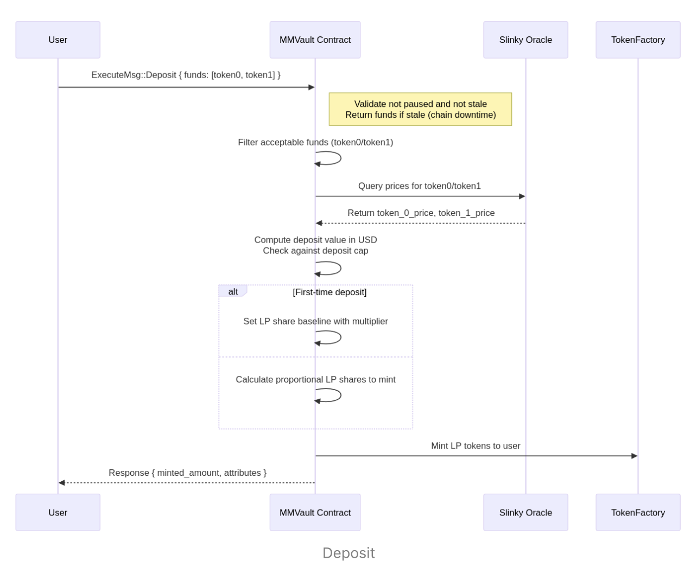
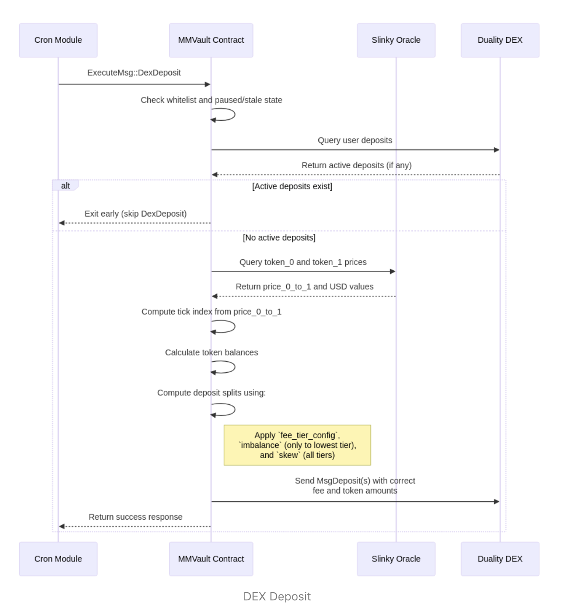
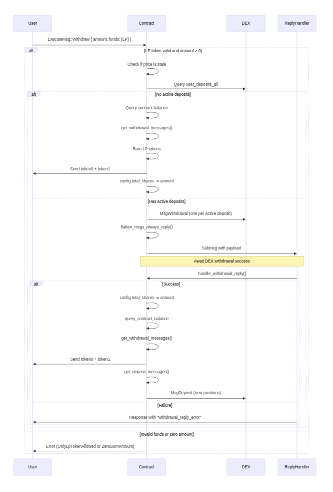
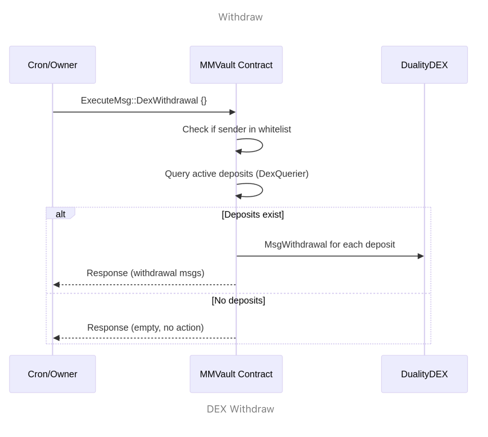

# Slinky Vault (IMM)

A decentralized vault system built on Neutron using CosmWasm smart contracts. The project integrates Neutron's feature set to create an Integrated Market Maker (IMM) with high-frequency oracle integration and concentrated liquidity management via constant sum AMMs.


## System overview

The mmvault contract is a liquidity management vault deployed on the Neutron
blockchain. Its primary purpose is to manage user deposits of two tokens (e.g., token0
and token1 ) and efficiently allocate liquidity into the Neutron DEX (Duality) by
performing automated deposits and withdrawals, driven by off-chain price data and
strategic configuration parameters.
The vault contract abstracts away direct DEX interactions from end users. Instead,
users interact with the vault through standardized deposit and withdrawal flows, while
the vault itself takes full custody of
user assets and autonomously manages liquidity
provisioning via Cron-triggered rebalancing logic.

## Core Flows
### User Deposit
Users can deposit paired tokens into the vault using the `ExecuteMsg::Deposit` entry
point. In return, they receive LP shares (minted using the token factory module)
representing their proportional claim on the vault’s total value. Shares are minted
based on:
- Vault’s total value (fetched using slinky price oracle),
- Existing LP supply ( `config.totalshares` ), and
- Whether the deposit is the first-ever or a subsequent one.
Shares are minted using the `get_mint_amount()` logic, ensuring proportional issuance.
LP share tracking is maintained through `config.total_shares`, which increases on every
deposit

### User Withdrawal
Users can redeem their LP shares via `ExecuteMsg::Withdraw` , triggering a burn of the
specified amount of LP shares. If the vault holds no active DEX positions, the
withdrawal immediately transfers the user’s share of vault-held tokens using
`get_withdrawal_messages()`. If active DEX deposits exist, the vault issues a submessage 
to withdraw them (`MsgWithdrawal`), and the actual token payout happens in the reply
handler, followed by a fresh MsgDeposit to redeploy remaining liquidity.
The withdrawal flow ensures that config.total_shares decreases by the exact burned
amount.

### Automated DEX Rebalancing via Cron module
he vault relies on Neutron's Cron module to trigger periodic rebalancing of its DEX
positions through two privileged entry points:
1. dex_withdrawal() :
Executed first each block by Cron, this function:
- Queries all active DEX positions owned by the vault,
- Issues MsgWithdrawal messages to remove liquidity from all active pools,
- Ensures the vault regains custody of all tokens before re-depositing.
2. dex_deposit() :
Executed immediately after `dex_withdrawal()`, it:
- Verifies that all prior positions have been withdrawn,
- Fetches fresh oracle prices via the Slinky module,
- Computes the target tick index and rebalancing logic based on:
  - Fee tier allocation,
  - Imbalance between `token0`/`token1` values,
  - Configured skew/imbalance settings,
- Issues `MsgDeposit` messages to redeploy liquidity across different price ranges
and fee tiers.

All deposits and withdrawals are issued on behalf of the vault (`creator` == `receiver` ==
`contract address`), ensuring it retains full custody of all f
unds and LP shares.

### System Architecture Flow






## Components

```
├── contracts/
│   ├── mmvault/           # Core vault (IMM) implementation
│   ├── slinky-oracle/     # Primary oracle
│   ├── lst-oracle/        # LST rate oracle
│   └── dasset-oracle/     # Drop d-asset oracle
```

## Development
      
### Prerequisites
- Rust 1.69 or higher
- Cargo with Wasm target: `rustup target add wasm32-unknown-unknown`
- [Neutron CLI](https://docs.neutron.org/neutron/cli-client)
- Make
- Docker (for building)

### Environment Setup
```bash
# Install Rust
curl --proto '=https' --tlsv1.2 -sSf https://sh.rustup.rs | sh
# Add Wasm target
rustup target add wasm32-unknown-unknown
# Clone repository
git clone https://github.com/your-org/slinky-vault
cd slinky-vault
```

### Build and Test
```bash
# Build all contracts
make optimize

# Run tests
make test
```

## License

TBD -

## Security

For security concerns, please email nicholas.evans@hadronlabs.org

